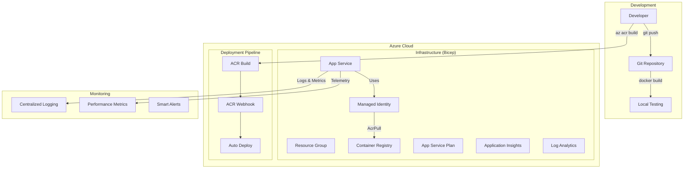

# 🪔 Interactive Lamp Web App

> **Modern containerized Python web application with production-ready Azure infrastructure**

A beautiful, interactive hanging lamp web application built with FastAPI, featuring a modular Bicep infrastructure and modern DevOps practices for seamless Azure deployment.

---

## 📋 Table of Contents

- [✨ Features](#-features)
- [🏗️ Architecture](#️-architecture)
- [🚀 Quick Start](#-quick-start)
- [☁️ Azure Deployment](#️-azure-deployment)
- [🔧 Development](#-development)
- [🐳 Docker](#-docker)
- [🔒 Security](#-security)
- [📊 Monitoring](#-monitoring)
- [🤝 Contributing](#-contributing)

---

## ✨ Features

### 🎨 **Interactive Experience**
- **Dynamic Lamp Control**: Pull the string to toggle the lamp on/off with realistic physics
- **Smooth Animations**: Fluid transitions using Anime.js for professional feel
- **Responsive Design**: Optimized for desktop, tablet, and mobile devices
- **Accessibility**: Full keyboard navigation and screen reader support

### 🏗️ **Production Architecture**
- **Modular Bicep Infrastructure**: Maintainable, reusable Azure infrastructure as code
- **Container-First**: Optimized Docker containers with multi-stage builds
- **Auto-Scaling**: Azure App Service with configurable scaling policies
- **Zero-Downtime Deployment**: ACR webhooks for continuous deployment

### 🔒 **Enterprise Security**
- **Managed Identity**: Secure Azure resource authentication without credentials
- **HTTPS-Only**: TLS encryption enforced across all endpoints
- **Role-Based Access**: Least privilege ACR access with AcrPull role
- **Secret-Free**: No hardcoded credentials or connection strings

---

## 🏗️ Architecture



### 🧩 **Modular Infrastructure**

| Component | Purpose | Technology |
|-----------|---------|------------|
| **🔍 Monitoring** | Observability & logging | Log Analytics + Application Insights |
| **🔐 Identity** | Secure authentication | User-assigned Managed Identity |
| **📦 Container Platform** | Image storage & management | Azure Container Registry |
| **🌐 Compute** | Application hosting | App Service with Linux containers |
| **🔗 Integration** | CI/CD automation | ACR webhooks + role assignments |

---

## 🚀 Quick Start

### Prerequisites
```bash
# Required tools
az --version      # Azure CLI
docker --version  # Docker
bicep --version   # Bicep CLI
```

### 1️⃣ **Clone & Setup**
```bash
git clone <repository-url>
cd lamp_web_app

# Make scripts executable
chmod +x start.sh deploy-to-azure.sh
```

### 2️⃣ **Local Development**
```bash
# Quick start with auto-setup
./start.sh

# Or manual setup
python3 -m venv venv
source venv/bin/activate
pip install -r src/requirements.txt
python src/main.py
```

### 3️⃣ **Deploy to Azure**
```bash
# Login to Azure
az login

# Deploy infrastructure + application
./deploy-to-azure.sh
```

**🎉 That's it! Your app will be live in minutes with:**
- ✅ Production-ready infrastructure
- ✅ Automated deployment pipeline
- ✅ Comprehensive monitoring
- ✅ Enterprise security

---

## ☁️ Azure Deployment

### 🎯 **Modern Infrastructure (Recommended)**

We've completely modernized the infrastructure using **modular Bicep templates**:

```bash
# Deploy using modern Bicep infrastructure
cd infra

# Preview deployment
az deployment sub create \
  --location eastus2 \
  --template-file main.bicep \
  --parameters main.bicepparam \
  --what-if

# Deploy infrastructure
az deployment sub create \
  --location eastus2 \
  --template-file main.bicep \
  --parameters main.bicepparam

# Build and deploy application
az acr build --registry <acr-name> --image lamp-app:latest .
```

### 📁 **Infrastructure Structure**
```
infra/
├── 📄 main.bicep                    # 🎯 Main orchestration template
├── ⚙️ main.bicepparam              # 🔧 Modern parameter file  
├── 🔧 bicepconfig.json             # 📋 Bicep linting configuration
└── 📁 modules/
    ├── 🔍 monitoring.bicep         # Log Analytics + App Insights
    ├── 🔐 managed-identity.bicep   # User-assigned identity
    ├── 📦 acr.bicep               # Container registry
    ├── 🌐 appservice.bicep        # App Service plan + web app
    └── 🔗 acr-integration.bicep   # Role assignment + webhook
```

### 🔧 **Environment Configuration**

Customize deployment via `infra/main.bicepparam`:

```bicep
// Environment Configuration
param environmentName = 'dev'           // dev, staging, prod
param location = 'eastus2'              // Azure region
param resourceGroupName = 'rg-lamp-web-app-dev'

// App Service Configuration  
param appServicePlanSku = 'B1'          // B1, S1, P1v3, etc.
param appPort = '8000'                  // Application port

// Container Registry
param containerRegistrySku = 'Basic'    // Basic, Standard, Premium
```

### 🚀 **Legacy Deployment (Shell Script)**

For backward compatibility, the shell script is still available:

```bash
# Automated deployment with modern best practices
./deploy-to-azure.sh

# Features:
# ✅ Infrastructure validation
# ✅ Resource provisioning
# ✅ Docker build & push
# ✅ Webhook configuration
# ✅ Health verification
```

---

## 🔧 Development

### 📁 **Project Structure**
```
lamp_web_app/
├── 📁 src/                         # 🐍 Python application
│   ├── main.py                     # FastAPI entry point
│   ├── server.py                   # Server configuration
│   ├── requirements.txt            # Python dependencies
│   ├── 📁 static/                  # Frontend assets
│   │   ├── style.css              # Application styles
│   │   └── script.js              # Interactive functionality
│   ├── 📁 templates/               # Jinja2 templates
│   │   └── index.html             # Main UI template
│   └── preview.html               # Development preview
├── 📁 infra/                       # ☁️ Azure infrastructure
│   ├── main.bicep                 # Main Bicep template
│   ├── main.bicepparam            # Parameters
│   └── modules/                   # Modular components
├── 🐳 Dockerfile                   # Container definition
├── 🚀 start.sh                     # Development script
├── ☁️ deploy-to-azure.sh           # Azure deployment
└── 📖 README.md                    # This documentation
```

### �️ **Development Workflow**

1. **🧪 Local Testing**
   ```bash
   ./start.sh                    # Start development server
   open http://localhost:8000    # Test functionality
   ```

2. **🏗️ Infrastructure Validation**
   ```bash
   cd infra
   bicep build main.bicep        # Validate Bicep syntax
   az deployment sub validate    # Validate Azure deployment
   ```

3. **🐳 Container Testing**
   ```bash
   docker build -t lamp-app .
   docker run -p 8000:8000 lamp-app
   ```

4. **☁️ Deploy Changes**
   ```bash
   az acr build --registry <acr-name> --image lamp-app:latest .
   # 🎯 Webhook automatically deploys to App Service!
   ```

---

## 🐳 Docker

### 🎯 **Production Optimizations**

Our Docker setup includes modern best practices:

```dockerfile
# Multi-stage build for optimal size
FROM python:3.13-slim as builder
# ... build dependencies

FROM python:3.13-slim as runtime  
# ... minimal runtime image
```

**Features:**
- ✅ **Multi-stage builds** for smaller images (~150MB)
- ✅ **Non-root user** for enhanced security
- ✅ **Health checks** for container monitoring
- ✅ **Layer caching** for faster builds
- ✅ **Security scanning** compatible

### 📦 **Docker Commands**

```bash
# Development
docker build -t lamp-app .
docker run -p 8000:8000 lamp-app

# Production
docker build -t lamp-app:prod .
docker run -d --name lamp-app \
  -p 8000:8000 \
  --restart unless-stopped \
  lamp-app:prod

# Health check
curl http://localhost:8000/health
```

---

## 🔒 Security

### 🛡️ **Enterprise Security Features**

| Security Layer | Implementation | Benefit |
|----------------|----------------|---------|
| **Identity** | User-assigned Managed Identity | No credential management |
| **Access** | Azure RBAC with AcrPull role | Least privilege access |
| **Transport** | HTTPS-only enforcement | Encrypted communication |
| **Storage** | Private container registry | Secure image storage |
| **Secrets** | Azure Key Vault integration ready | No hardcoded secrets |

### 🔐 **Security Validations**

```bash
# Check security configuration
az webapp show --name <app-name> --resource-group <rg> \
  --query "{httpsOnly:httpsOnly, identity:identity.type}"

# Verify role assignments  
az role assignment list --assignee <principal-id> \
  --query "[].{Role:roleDefinitionName, Scope:scope}"
```

---

## 📊 Monitoring

### 📈 **Built-in Observability**

**Real-time Monitoring:**
- 🔍 **Application Insights** - Performance, errors, dependencies
- 📋 **Log Analytics** - Centralized logging and queries
- 🚨 **Smart Alerts** - Proactive issue detection
- 📊 **Custom Dashboards** - Business metrics visualization

**Key Metrics Tracked:**
- Application response times
- Error rates and exceptions
- Container resource utilization
- User interaction patterns

### 🔍 **Monitoring Access**

```bash
# View application logs
az webapp log tail --name <app-name> --resource-group <rg>

# Application Insights metrics
az monitor app-insights component show \
  --app <ai-name> --resource-group <rg>

# Custom queries in Log Analytics
az monitor log-analytics query \
  --workspace <workspace-id> \
  --analytics-query "requests | summarize count() by bin(timestamp, 1h)"
```

---

## 🤝 Contributing

### 🔄 **Development Workflow**

1. **🍴 Fork & Clone**
   ```bash
   git clone <your-fork>
   cd lamp_web_app
   ```

2. **🧪 Test Locally**
   ```bash
   ./start.sh
   # Test your changes
   ```

3. **🏗️ Validate Infrastructure**
   ```bash
   cd infra
   bicep build main.bicep
   az deployment sub validate --template-file main.bicep --parameters main.bicepparam
   ```

4. **🐳 Test Container**
   ```bash
   docker build -t lamp-app-dev .
   docker run -p 8000:8000 lamp-app-dev
   ```

5. **📤 Submit PR**
   ```bash
   git push origin feature-branch
   # Create pull request
   ```

### 📋 **Contribution Guidelines**

- ✅ Follow Python PEP 8 style guidelines
- ✅ Update tests for new features
- ✅ Validate Bicep templates before submission
- ✅ Include documentation updates
- ✅ Test on multiple environments

---

## 🛠️ **Technologies**

### Backend Stack
- **🐍 FastAPI** - Modern Python web framework
- **🚀 Uvicorn** - ASGI server for production
- **🐳 Docker** - Containerization
- **☁️ Azure App Service** - Cloud hosting

### Frontend Stack  
- **🎨 Vanilla JavaScript** - Interactive functionality
- **✨ Anime.js** - Smooth animations
- **🎨 CSS3** - Modern styling
- **📱 Responsive Design** - Mobile-first approach

### Infrastructure
- **🏗️ Azure Bicep** - Infrastructure as Code
- **🔐 Managed Identity** - Secure authentication
- **📦 Azure Container Registry** - Private image registry
- **📊 Application Insights** - APM & monitoring

---

## 📄 License

This project is open source and available under the [MIT License](LICENSE).

---

<div align="center">

**🎉 Built with ❤️ using modern Azure practices**

🚀 **Ready for Production** | 🔒 **Enterprise Secure** | 📊 **Fully Monitored**

</div>
RESOURCE_GROUP="lamp-app-rg"
APP_NAME="lamp-web-app-$(date +%s)"  # Unique name with timestamp
LOCATION="eastus2"  # Choose a region close to you
ACR_NAME="lampappregistry$(date +%s)"  # Must be globally unique

# Create resource group
az group create --name $RESOURCE_GROUP --location $LOCATION

# Create Azure Container Registry (Basic tier, NO admin user for security)
az acr create --resource-group $RESOURCE_GROUP \
  --name $ACR_NAME \
  --sku Basic \
  --admin-enabled false

# Create App Service Plan (Free tier)
az appservice plan create \
  --name "${APP_NAME}-plan" \
  --resource-group $RESOURCE_GROUP \
  --sku F1 \
  --is-linux

# Create Web App
az webapp create \
  --resource-group $RESOURCE_GROUP \
  --plan "${APP_NAME}-plan" \
  --name $APP_NAME \
  --deployment-container-image-name ${ACR_NAME}.azurecr.io/lamp-app:latest
```

### Step 2: Configure System-Managed Identity

```bash
# Enable system-managed identity for the Web App
PRINCIPAL_ID=$(az webapp identity assign \
  --resource-group $RESOURCE_GROUP \
  --name $APP_NAME \
  --query principalId \
  --output tsv)

# Assign AcrPull role to the system-managed identity for secure ACR access
az role assignment create \
  --assignee $PRINCIPAL_ID \
  --scope $(az acr show --name $ACR_NAME --resource-group $RESOURCE_GROUP --query id --output tsv) \
  --role AcrPull
```

### Step 3: Build and Push Docker Image

```bash
# Get ACR login server
ACR_LOGIN_SERVER=$(az acr show --name $ACR_NAME --resource-group $RESOURCE_GROUP --query loginServer --output tsv)

# Login to ACR using your Azure credentials (no admin credentials needed)
az acr login --name $ACR_NAME

# Build and tag the image
docker build -t $ACR_LOGIN_SERVER/lamp-app:latest .

# Push image to ACR (using your authenticated session)
docker push $ACR_LOGIN_SERVER/lamp-app:latest
```

### Step 4: Configure Web App with System-Managed Identity

```bash
# Configure the web app to use system-managed identity for ACR authentication
az webapp config container set \
  --name $APP_NAME \
  --resource-group $RESOURCE_GROUP \
  --docker-custom-image-name $ACR_LOGIN_SERVER/lamp-app:latest \
  --docker-registry-server-url https://$ACR_LOGIN_SERVER

# Configure app settings
az webapp config appsettings set \
  --resource-group $RESOURCE_GROUP \
  --name $APP_NAME \
  --settings PORT=8000 PYTHONPATH=/app/src

# Enable HTTPS only for security
az webapp update \
  --resource-group $RESOURCE_GROUP \
  --name $APP_NAME \
  --https-only true

# Enable container logging
az webapp log config \
  --resource-group $RESOURCE_GROUP \
  --name $APP_NAME \
  --docker-container-logging filesystem
```

### Step 5: Access Your App

```bash
# Get the actual URL of your deployed app
az webapp show --name $APP_NAME --resource-group $RESOURCE_GROUP --query defaultHostName --output tsv

# Check deployment status
az webapp show --name $APP_NAME --resource-group $RESOURCE_GROUP --query state --output tsv

# View logs (if needed for troubleshooting)
az webapp log tail --name $APP_NAME --resource-group $RESOURCE_GROUP
```

### 🔄 Update Deployment

To update your app with new changes:

```bash
# Using the update script (recommended - auto-discovers resources)
./update-app.sh
# ✨ Now with automatic webhook deployment! Just push and wait.

# Or specify resources explicitly
./update-app.sh RESOURCE_GROUP APP_NAME ACR_NAME

# Or using the full deployment script
./deploy-to-azure.sh

# Or manually rebuild and push updated image (if webhook is set up)
docker build -t $ACR_LOGIN_SERVER/lamp-app:latest .
docker push $ACR_LOGIN_SERVER/lamp-app:latest
# 🎯 Webhook automatically triggers App Service update - no restart needed!

# Manual restart (only needed if no webhook)
az webapp restart --name $APP_NAME --resource-group $RESOURCE_GROUP
```

### 🤖 Continuous Deployment with ACR Webhooks

The deployment script automatically sets up ACR webhooks for continuous deployment:

- **Automatic Updates**: Push to ACR → Webhook triggers → App Service pulls new image
- **No Manual Intervention**: No need to restart the app service manually
- **Real-time Deployment**: Changes deploy within 2-3 minutes of pushing
- **Webhook Management**: 
  ```bash
  # List webhooks
  az acr webhook list --registry ACR_NAME --output table
  
  # View webhook events
  az acr webhook list-events --registry ACR_NAME --name APP_NAME-webhook
  
  # Test webhook
  az acr webhook ping --registry ACR_NAME --name APP_NAME-webhook
  ```

### 🧹 Cleanup Resources

When you're done testing, clean up to avoid charges:

```bash
# Delete the entire resource group (removes all resources)
az group delete --name $RESOURCE_GROUP --yes --no-wait
```

### 💡 Azure Free Tier Limitations

- **App Service Plan F1**: 1 GB RAM, 1 GB storage, 60 CPU minutes/day
- **Container Registry Basic**: 10 GB storage, unlimited pulls
- **Resource Group**: No cost, but monitor overall Azure free tier limits

### 🔒 Security Best Practices Implemented

- **✅ System-Managed Identity**: Web app uses system-managed identity for secure ACR access (no user-assigned identity needed)
- **✅ No Admin Credentials**: ACR admin user disabled, uses RBAC instead
- **✅ Least Privilege**: System-managed identity has only AcrPull permissions (minimum required)
- **✅ HTTPS Only**: All traffic forced to HTTPS for encryption in transit
- **✅ No Hardcoded Secrets**: No usernames/passwords stored in app configuration
- **✅ Resource Scoping**: Identity scoped to specific ACR resource
- **✅ RBAC Authentication**: Role-based access control instead of shared credentials
- **✅ Container Registry Privacy**: Private registry with identity-based authentication
- **✅ Automated Deployment**: Robust script with error handling and validation
- **✅ Webhook Security**: Secure webhook URLs with proper authentication

## 🐳 Docker Commands

### Development
```bash
# Build the image
docker build -t lamp-app .

# Run the container
docker run -p 8000:8000 lamp-app

# Run with environment variables
docker run -p 8000:8000 -e PORT=8000 lamp-app
```

### Production
```bash
# Build for production
docker build -t lamp-app:prod .

# Run in production mode
docker run -d --name lamp-app -p 8000:8000 --restart unless-stopped lamp-app:prod
```

## 🛠️ Docker Best Practices Implemented

- **Multi-stage builds**: Optimized image size
- **Non-root user**: Enhanced security
- **Health checks**: Container health monitoring
- **Environment variables**: Configurable runtime
- **Slim base image**: Python 3.13-slim for smaller footprint
- **Layer caching**: Efficient builds with proper layer ordering
- **Security**: No new privileges, resource limits

## 🔧 Configuration

### Environment Variables

- `PORT`: Application port (default: 8000)
- `PYTHONPATH`: Python path (set to `/app/src` in Docker)

### Health Check

The application includes a health check endpoint at `/health`

## 🎨 Technologies Used

- **Backend**: FastAPI (Python 3.13)
- **Frontend**: Vanilla JavaScript, CSS3, HTML5
- **Animations**: Anime.js library
- **Containerization**: Docker
- **Cloud Platform**: Azure App Service
- **Container Registry**: Azure Container Registry
- **Web Server**: Uvicorn (ASGI server)

## 📱 Browser Support

- Chrome 90+
- Firefox 88+
- Safari 14+
- Edge 90+

## 🔗 API Endpoints

- `GET /`: Main application interface
- `GET /health`: Health check endpoint
- `GET /static/*`: Static file serving

## 🤝 Contributing

1. Fork the repository
2. Create a feature branch
3. Make your changes
4. Test with Docker
5. Submit a pull request

## 📄 License

This project is open source and available under the [MIT License](LICENSE).
