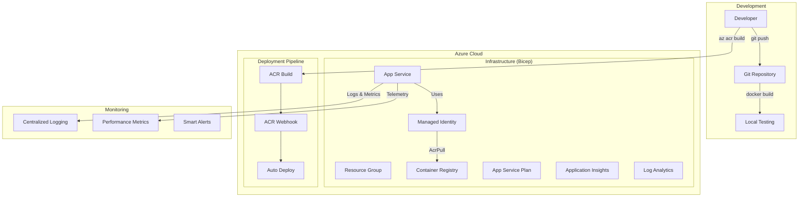

# 🪔 Interactive Lamp Web App

[](https://github.com/jaredthivener/python-lamp-web-app/actions/workflows/security-native.yml)

> **Modern containerized Python web application with production-ready Azure infrastructure**

A beautiful, interactive hanging lamp web application built with FastAPI, featuring modular Bicep infrastructure and modern DevOps practices for seamless Azure deployment.

---

## 📋 Table of Contents

- [✨ Features](#-features)
- [🏗️ Architecture](#️-architecture)
- [🚀 Quick Start](#-quick-start)
- [☁️ Azure Deployment](#️-azure-deployment)
- [🔧 Development](#-development)
- [🐳 Docker](#-docker)
- [🔒 Security](#-security)
- [📊 Monitoring](#-monitoring)
- [🤝 Contributing](#-contributing)

---

## ✨ Features

### 🎨 **Interactive Experience**

- **Dynamic Lamp Control**: Pull the string to toggle the lamp on/off with realistic physics
- **Smooth Animations**: Fluid transitions using Anime.js for professional feel
- **Responsive Design**: Optimized for desktop, tablet, and mobile devices
- **Accessibility**: Full keyboard navigation and screen reader support

### 🏗️ **Architecture**

- **Modular Bicep Infrastructure**: Maintainable, reusable Azure infrastructure as code
- **Container-First**: Optimized Docker containers with multi-stage builds
- **Auto-Scaling**: Azure App Service with configurable scaling policies
- **Zero-Downtime Deployment**: ACR webhooks for continuous deployment

### 🔒 **Enterprise Security**

- **Managed Identity**: Secure Azure resource authentication without credentials
- **HTTPS-Only**: TLS encryption enforced across all endpoints
- **Role-Based Access**: Least privilege ACR access with AcrPull role
- **Secret-Free**: No hardcoded credentials or connection strings

---

## 🏗️ Architecture



### 🧩 **Modular Infrastructure**

| Component                 | Purpose                    | Technology                           |
| ------------------------- | -------------------------- | ------------------------------------ |
| **🔍 Monitoring**         | Observability & logging    | Log Analytics + Application Insights |
| **🔐 Identity**           | Secure authentication      | System-assigned Managed Identity     |
| **📦 Container Platform** | Image storage & management | Azure Container Registry             |
| **🌐 Compute**            | Application hosting        | App Service with Linux containers    |
| **🔗 Integration**        | CI/CD automation           | ACR webhooks + role assignments      |

---

## 🚀 Quick Start

### Prerequisites

```bash
# Required tools
az --version      # Azure CLI
docker --version  # Docker
bicep --version   # Bicep CLI (optional for infrastructure)
```

### 1️⃣ **Clone & Setup**

```bash
git clone <repository-url>
cd python-lamp-web-app

# Make scripts executable
chmod +x start.sh
```

### 2️⃣ **Local Development**

```bash
# Quick start with auto-setup
./start.sh

# Or manual setup
python3 -m venv venv
source venv/bin/activate
pip install -r src/requirements.txt
python3 src/main.py
```

### 3️⃣ **Deploy to Azure**

```bash
# Login to Azure
az login

# Deploy infrastructure + application (recommended)
azd up
```

**🎉 That's it! Your app will be live in minutes with full monitoring and continuous deployment!**

---

## ☁️ Azure Deployment

### 🎯 **Modern Infrastructure (Recommended)**

Deploy using **modular Bicep templates** for production-ready infrastructure:

```bash
# Navigate to infrastructure directory
cd infra

# Preview deployment
az deployment sub create \
  --location eastus2 \
  --template-file main.bicep \
  --parameters main.bicepparam \
  --what-if

# Deploy infrastructure
az deployment sub create \
  --location eastus2 \
  --template-file main.bicep \
  --parameters main.bicepparam

# Build and deploy application
az acr build --registry <acr-name> --image lamp-app:latest .
```

### 📁 **Infrastructure Structure**

```
infra/
├── 📄 main.bicep                    # 🎯 Main orchestration template
├── ⚙️ main.bicepparam              # 🔧 Modern parameter file
├── 🔧 bicepconfig.json             # 📋 Bicep linting configuration
└── 📁 modules/
    ├── 🔍 monitoring.bicep         # Log Analytics + App Insights
    ├── 🔐 managed-identity.bicep   # System-assigned identity
    ├── 📦 acr.bicep               # Container registry
    ├── 🌐 appservice.bicep        # App Service plan + web app
    └── 🔗 acr-integration.bicep   # Role assignment + webhook
```

### 🔧 **Environment Configuration**

Customize deployment via `infra/main.bicepparam`:

```bicep
// Environment Configuration
param environmentName = 'dev'           // dev, staging, prod
param location = 'eastus2'              // Azure region
param resourceGroupName = 'rg-lamp-web-app-dev'

// App Service Configuration
param appServicePlanSku = 'B1'          // B1, S1, P1v3, etc.
param appPort = '8000'                  // Application port

// Container Registry
param containerRegistrySku = 'Basic'    // Basic, Standard, Premium
```

### 🚀 **Quick Deployment (Shell Script)**

For rapid deployment with automated best practices:

```bash
# Automated deployment with modern best practices
./deploy-to-azure.sh

# Features:
# ✅ Infrastructure validation
# ✅ Resource provisioning
# ✅ Docker build & push
# ✅ System-managed identity configuration
# ✅ Webhook setup for continuous deployment
# ✅ Health verification
```

### 🔄 **Update Deployment**

```bash
# Rebuild and push (webhook automatically deploys)
docker build -t <acr-name>.azurecr.io/lamp-app:latest .
docker push <acr-name>.azurecr.io/lamp-app:latest

# Or use ACR build
az acr build --registry <acr-name> --image lamp-app:latest .
```

---

## 🔧 Development

### 📁 **Project Structure**

```
python-lamp-web-app/
├── 📁 src/                      # 🐍  Python application
│   ├── main.py                  # 🚀  FastAPI entry point
│   ├── server.py                # ⚙️  Server configuration
│   ├── requirements.txt         # 📦  Python dependencies
│   ├── 📁 static/               # 🎨  Frontend assets
│   │   ├── style.css            # 💅  Application styles
│   │   └── script.js            # ⚡  Interactive functionality
│   └── 📁 templates/            # 📄  Jinja2 templates
│       └── index.html           # 🏠  Main UI template
├── 📁 infra/                    # ☁️  Azure infrastructure
│   ├── main.bicep               # 🎯  Main Bicep template
│   ├── main.bicepparam          # 🔧  Parameters
│   └── 📁 modules/              # 🧩  Modular components
├── 🐳 Dockerfile                # 📦  Container definition
├── 🚀 start.sh                  # 🛠️  Development script
├── ☁️ deploy-to-azure.sh        # ⚡  Azure deployment
└── 📖 README.md                 # 📚  This documentation
```

### 🛠️ **Development Workflow**

1. **🧪 Local Testing**

   ```bash
   ./start.sh                    # Start development server
   open http://localhost:8000    # Test functionality
   ```

2. **🏗️ Infrastructure Validation**

   ```bash
   cd infra
   bicep build main.bicep        # Validate Bicep syntax
   az deployment sub validate --template-file main.bicep --parameters main.bicepparam
   ```

3. **🐳 Container Testing**

   ```bash
   docker build -t lamp-app .
   docker run -p 8000:8000 lamp-app
   ```

4. **☁️ Deploy Changes**
   ```bash
   az acr build --registry <acr-name> --image lamp-app:latest .
   # 🎯 Webhook automatically deploys to App Service!
   ```

---

## 🐳 Docker

### 🎯 **Production Optimizations**

Our Docker setup includes modern best practices:

```dockerfile
# Multi-stage build for optimal size
FROM python:3.13.5-slim as builder
# ... build dependencies

FROM python:3.13.5-slim as runtime
# ... minimal runtime image
```

**Features:**

- ✅ **Multi-stage builds** for smaller images (~150MB)
- ✅ **Non-root user** for enhanced security
- ✅ **Health checks** for container monitoring
- ✅ **Layer caching** for faster builds
- ✅ **Security scanning** compatible

### 📦 **Docker Commands**

```bash
# Development
docker build -t lamp-app .
docker run -p 8000:8000 lamp-app

# Production
docker build -t lamp-app:prod .
docker run -d --name lamp-app \
  -p 8000:8000 \
  --restart unless-stopped \
  lamp-app:prod

# Health check
curl http://localhost:8000/health
```

---

## 🔒 Security

### 🛡️ **Enterprise Security Features**

| Security Layer | Implementation                    | Benefit                  |
| -------------- | --------------------------------- | ------------------------ |
| **Identity**   | System-assigned Managed Identity  | No credential management |
| **Access**     | Azure RBAC with AcrPull role      | Least privilege access   |
| **Transport**  | HTTPS-only enforcement            | Encrypted communication  |
| **Storage**    | Private container registry        | Secure image storage     |
| **Secrets**    | Azure Key Vault integration ready | No hardcoded secrets     |

### 🔐 **Security Validations**

```bash
# Check security configuration
az webapp show --name <app-name> --resource-group <rg> \
  --query "{httpsOnly:httpsOnly, identity:identity.type}"

# Verify role assignments
az role assignment list --assignee <principal-id> \
  --query "[].{Role:roleDefinitionName, Scope:scope}"
```

### ✅ **Security Best Practices Implemented**

- **System-Managed Identity**: Secure ACR access without stored credentials
- **No Admin Credentials**: ACR admin user disabled, uses RBAC instead
- **Least Privilege**: Only AcrPull permissions (minimum required)
- **HTTPS Only**: All traffic encrypted in transit
- **Resource Scoping**: Identity scoped to specific ACR resource
- **Automated Security**: Robust deployment with validation

---

## 📊 Monitoring

### 📈 **Built-in Observability**

**Real-time Monitoring:**

- 🔍 **Application Insights** - Performance, errors, dependencies
- 📋 **Log Analytics** - Centralized logging and queries
- 🚨 **Smart Alerts** - Proactive issue detection
- 📊 **Custom Dashboards** - Business metrics visualization

**Key Metrics Tracked:**

- Application response times
- Error rates and exceptions
- Container resource utilization
- User interaction patterns

### 🔍 **Monitoring Access**

```bash
# View application logs
az webapp log tail --name <app-name> --resource-group <rg>

# Application Insights metrics
az monitor app-insights component show \
  --app <ai-name> --resource-group <rg>

# Custom queries in Log Analytics
az monitor log-analytics query \
  --workspace <workspace-id> \
  --analytics-query "requests | summarize count() by bin(timestamp, 1h)"
```

---

## 🤝 Contributing

### 🔄 **Development Workflow**

1. **🍴 Fork & Clone**

   ```bash
   git clone <your-fork>
   cd python-lamp-web-app
   ```

2. **🧪 Test Locally**

   ```bash
   ./start.sh
   # Test your changes
   ```

3. **🏗️ Validate Infrastructure**

   ```bash
   cd infra
   bicep build main.bicep
   az deployment sub validate --template-file main.bicep --parameters main.bicepparam
   ```

4. **🐳 Test Container**

   ```bash
   docker build -t lamp-app-dev .
   docker run -p 8000:8000 lamp-app-dev
   ```

5. **📤 Submit PR**
   ```bash
   git push origin feature-branch
   # Create pull request
   ```

### 📋 **Contribution Guidelines**

- ✅ Follow Python PEP 8 style guidelines
- ✅ Update tests for new features
- ✅ Validate Bicep templates before submission
- ✅ Include documentation updates
- ✅ Test on multiple environments

---

## 🛠️ **Technologies**

### Backend Stack

- **🐍 FastAPI** - Modern Python web framework
- **🚀 Uvicorn** - ASGI server for production
- **🐳 Docker** - Containerization
- **☁️ Azure App Service** - Cloud hosting

### Frontend Stack

- **🎨 Vanilla JavaScript** - Interactive functionality
- **✨ Anime.js** - Smooth animations
- **🎨 CSS3** - Modern styling
- **📱 Responsive Design** - Mobile-first approach

### Infrastructure

- **🏗️ Azure Bicep** - Infrastructure as Code
- **🔐 Managed Identity** - Secure authentication
- **📦 Azure Container Registry** - Private image registry
- **📊 Application Insights** - APM & monitoring

---

## 📄 License

This project is open source and available under the [MIT License](LICENSE).

---

<div align="center">

**🎉 Built with ❤️ using modern Azure practices**

🚀 **Ready for Production** | 🔒 **Enterprise Secure** | 📊 **Fully Monitored**

</div>
