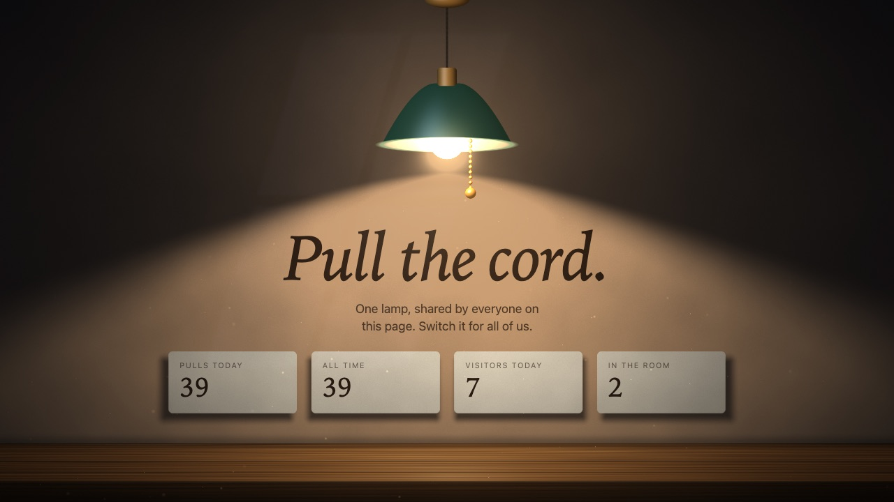

# 🪔 Lamp

[](https://github.com/jaredthivener/python-lamp-web-app/actions/workflows/ci.yml)
[](https://github.com/jaredthivener/python-lamp-web-app/actions/workflows/security-native.yml)

One lamp, shared by everyone who has the page open. Pull the cord and it switches for all of them, live.



- **Shared and live.** The lamp's state lives in Postgres and reaches every open page over Server-Sent Events.
- **Lit by a shader.** One WebGL fragment shader draws the lamp and the light it throws on the page.
- **Real physics, real sound.** The lamp is a pendulum and the chain a rope; the click is a recording of a real pull chain.
- **Nothing to build.** A FastAPI app and a few ES modules: no framework, no bundler, no CDN.
- **Accessible.** The cord is a real button (Tab, Enter, Space or `L`), and reduced motion and forced colours are respected.

## Run it

You need [uv](https://docs.astral.sh/uv/). It installs Python 3.15 and the dependencies on first run.

```bash
./start.sh        # http://localhost:8000
```

With no `POSTGRES_CONNECTION_STRING` set, the lamp is kept in a local SQLite file. Open the page in two windows to see them stay in step.

Or run the container:

```bash
docker build -t lamp-app .
docker run -p 8000:8000 lamp-app
```

## Test

```bash
uv run pytest     # API and storage (SQLite; CI repeats them on Postgres)
npm test          # lamp physics (plain Node, nothing to install)
```

## API

| Endpoint | Purpose |
| --- | --- |
| `GET /api/v1/lamp/status` | The lamp's state and counters |
| `POST /api/v1/lamp/toggle` | Pull the cord. Atomic in the database; at most two a second, lamp-wide |
| `GET /api/v1/lamp/events` | Server-Sent Events: the same snapshot, pushed whenever it changes |
| `GET /health` | Always 200; says whether the database answers |
| `GET /livez` | For health probes: answers without touching the database |

Any number of replicas can run: they share nothing but the database. If it goes away, the page keeps showing the last known state and pulls fail loudly.

## Deploy

The lamp runs on Azure Kubernetes Service: Arm64 nodes on Azure Linux, Gateway API ingress with automatic TLS, passwordless Postgres, and Flux applying whatever CI publishes from `main`.

Run the **Deploy Azure Infrastructure** workflow to create it. [infra/README.md](infra/README.md) covers what it creates, what it costs, and how to work with the cluster.

## Layout

```
src/            FastAPI app (main.py, store.py) and the page (static/)
tests/          pytest and Node tests
k8s/            Kubernetes manifests that Flux applies
infra/          Azure infrastructure (Bicep)
Dockerfile      The image CI builds and the cluster runs
pyproject.toml  The only dependency list
```

## Contributing

Issues and pull requests are welcome. Run both test suites first. To report a vulnerability, see [SECURITY.md](SECURITY.md).

## Credits

The pull-chain sound is cut from ["Desk Lamp - Chain Pull (Fast)"](https://freesound.org/s/541762/) by PhillipArthurSimmons on Freesound, released into the public domain (CC0).

## License

[MIT](LICENSE)
