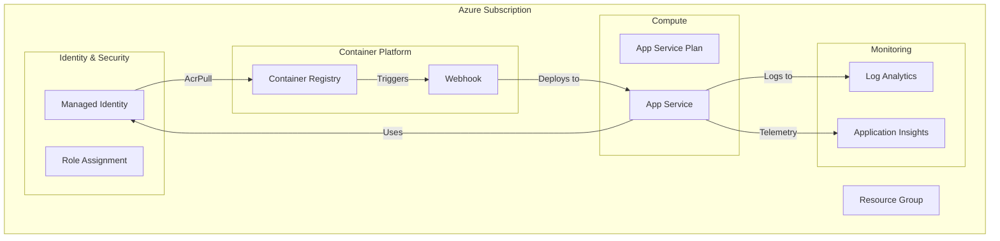

# 🏗️ Azure Infrastructure - Lamp Web App

> **Modern Bicep Infrastructure with Modular Design**

A production-ready, secure, and scalable Azure infrastructure for the Lamp Web App using modular Bicep templates with modern parameter files (.bicepparam) and comprehensive monitoring.

---

## 📋 Table of Contents

- [🎯 Overview](#-overview)
- [🏛️ Architecture](#️-architecture)
- [🚀 Quick Start](#-quick-start)
- [🔧 Configuration](#-configuration)
- [🔒 Security Features](#-security-features)
- [📊 Monitoring](#-monitoring)
- [🔄 CI/CD Integration](#-cicd-integration)
- [📁 Project Structure](#-project-structure)
- [🤝 Contributing](#-contributing)

---

## 🎯 Overview

This infrastructure deploys a **containerized Python web application** to Azure using:

- **🧩 Modular Bicep templates** for maintainability
- **🔐 User-assigned managed identity** for secure ACR access
- **📈 Comprehensive monitoring** with Application Insights
- **🔄 Automated deployment** via ACR webhooks
- **✅ Modern .bicepparam files** for parameters

### Key Benefits
- ✅ **Zero cyclic dependencies**
- ✅ **Production-ready security**
- ✅ **Environment agnostic**
- ✅ **Fully automated**

---

## 🏛️ Architecture



### 📦 Module Breakdown

| Module | Resources | Purpose | Dependencies |
|--------|-----------|---------|--------------|
| **🔍 Monitoring** | Log Analytics, App Insights | Observability & logging | None |
| **🔐 Identity** | User-Assigned Identity | Secure authentication | None |
| **📦 Container Registry** | ACR | Image storage | None |
| **🌐 App Service** | Plan, Web App, Diagnostics | Application hosting | Identity, Monitoring, ACR |
| **🔗 Integration** | Role assignment, Webhook | ACR ↔ App Service connection | All above |

---

## 🚀 Quick Start

### Prerequisites
```bash
# Install Azure CLI
az --version

# Install Bicep CLI
az bicep version

# Login to Azure
az login
```

### 1️⃣ Deploy Infrastructure
```bash
# Navigate to infrastructure directory
cd infra

# Preview deployment (What-If)
az deployment sub create \
  --location eastus2 \
  --template-file main.bicep \
  --parameters main.bicepparam \
  --what-if

# Deploy infrastructure
az deployment sub create \
  --location eastus2 \
  --template-file main.bicep \
  --parameters main.bicepparam
```

### 2️⃣ Build & Deploy Application
```bash
# Build and push container image
az acr build --registry <acr-name> --image lamp-app:latest .

# App automatically deploys via webhook! 🎉
```

---

## 🔧 Configuration

### Environment Parameters

The `main.bicepparam` file contains all deployment parameters:

```bicep
// Environment Configuration
param environmentName = 'dev'           // dev, staging, prod
param location = 'eastus2'              // Azure region
param resourceGroupName = 'rg-lamp-web-app-dev'

// App Service Configuration  
param appServicePlanSku = 'B1'          // B1, S1, P1v3, etc.
param appPort = '8000'                  // Application port

// Container Registry
param containerRegistrySku = 'Basic'    // Basic, Standard, Premium
```

### 🌍 Multiple Environments

Create environment-specific parameter files:

```bash
# Development
main.bicepparam

# Staging  
staging.bicepparam

# Production
production.bicepparam
```

---

## 🔒 Security Features

### ✅ Identity & Access Management
- **User-assigned managed identity** for predictable security
- **Least privilege access** (AcrPull role only)
- **No stored credentials** or connection strings

### ✅ Network Security
- **HTTPS-only** enforcement
- **Secure webhook** configuration
- **Private container registry** access

### ✅ Monitoring & Compliance
- **Comprehensive logging** to Log Analytics
- **Application telemetry** via App Insights
- **Diagnostic settings** for all resources

---

## 📊 Monitoring

### Built-in Observability

| Component | Purpose | Access |
|-----------|---------|--------|
| **📈 Application Insights** | Performance, errors, usage | Azure Portal → App Insights |
| **📋 Log Analytics** | Centralized logging | Azure Portal → Log Analytics |
| **🔍 App Service Logs** | HTTP, console, app logs | Azure Portal → App Service → Logs |

### Key Metrics Tracked
- Application performance
- Error rates and exceptions  
- HTTP request patterns
- Resource utilization

---

## 🔄 CI/CD Integration

### Automatic Deployment Flow

1. **Code Push** → GitHub/Azure DevOps
2. **Container Build** → Azure Container Registry
3. **Image Push** → Triggers ACR webhook
4. **Auto Deploy** → App Service pulls latest image
5. **Monitoring** → Telemetry flows to App Insights

### GitHub Actions Example
```yaml
- name: Build and Push to ACR
  run: |
    az acr build \
      --registry ${{ env.ACR_NAME }} \
      --image lamp-app:${{ github.sha }} \
      .
```

---

## 📁 Project Structure
```
infra/
├── 📄 main.bicep                    # 🎯 Main orchestration template
├── ⚙️ main.bicepparam              # 🔧 Modern parameter file
├── 🔧 bicepconfig.json             # 📋 Bicep linting configuration
├── 📖 README.md                    # 📚 This documentation
└── 📁 modules/
    ├── 🔍 monitoring.bicep         # Log Analytics + App Insights
    ├── 🔐 managed-identity.bicep   # User-assigned identity
    ├── 📦 acr.bicep               # Container registry
    ├── 🌐 appservice.bicep        # App Service plan + web app
    └── 🔗 acr-integration.bicep   # Role assignment + webhook
```

---

## 🤝 Contributing

### Development Workflow

1. **🧪 Validate Changes**
   ```bash
   # Lint all Bicep files
   bicep build main.bicep
   
   # Validate deployment
   az deployment sub validate \
     --location eastus2 \
     --template-file main.bicep \
     --parameters main.bicepparam
   ```

2. **🔍 Test Modules**
   ```bash
   # Test individual modules
   bicep build modules/monitoring.bicep
   bicep build modules/acr.bicep
   # ... etc
   ```

3. **📊 Preview Changes**
   ```bash
   # Preview with What-If
   az deployment sub create \
     --location eastus2 \
     --template-file main.bicep \
     --parameters main.bicepparam \
     --what-if
   ```

### Best Practices

- ✅ Always use `.bicepparam` files for parameters
- ✅ Enable Bicep linting with `bicepconfig.json`
- ✅ Follow naming conventions with resource tokens
- ✅ Use managed identities over service principals
- ✅ Tag all resources consistently
- ✅ Validate before deploying

---

## 📚 Additional Resources

| Resource | Description |
|----------|-------------|
| [Azure Bicep Documentation](https://docs.microsoft.com/azure/azure-resource-manager/bicep/) | Official Bicep docs |
| [Azure App Service](https://docs.microsoft.com/azure/app-service/) | App Service documentation |
| [Azure Container Registry](https://docs.microsoft.com/azure/container-registry/) | ACR documentation |
| [Azure Monitor](https://docs.microsoft.com/azure/azure-monitor/) | Monitoring and observability |

---

<div align="center">

**🎉 Happy Deploying! 🚀**

Built with ❤️ using Azure Bicep

</div>
