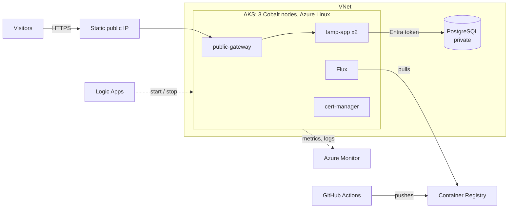

# ☁️ Azure Infrastructure - Lamp Web App

The lamp runs on Azure Kubernetes Service. Everything here is Bicep, deployed with `azd provision`, and sized to fit inside a $150/month credit.

## 🏛️ What gets deployed


```mermaid
graph LR
    U[Visitors] -->|HTTPS| IP[Static public IP]
    subgraph VNet
        subgraph AKS["AKS: 3 Cobalt nodes, Azure Linux"]
            GW[public-gateway] --> APP[lamp-app x2]
            FLUX[Flux]
            CM[cert-manager]
        end
        PG[(PostgreSQL<br/>private)]
    end
    IP --> GW
    APP -->|Entra token| PG
    FLUX -->|pulls| ACR[Container Registry]
    CI[GitHub Actions] -->|pushes| ACR
    AKS -.->|metrics, logs| MON[Azure Monitor]
    SCHED[Logic Apps] -.->|start / stop| AKS
```

| Module | What it creates |
| --- | --- |
| `network/network.bicep` | Virtual network, a subnet delegated to PostgreSQL, its private DNS zone, and the static public IP (with a DNS name) the site is served on |
| `compute/aks.bicep` | The cluster, its role assignments, workload identity federation, and the Flux extension and configuration |
| `compute/schedule.bicep` | Two Logic Apps that start the cluster in the morning and stop it in the evening |
| `database/postgresql.bicep` | PostgreSQL flexible server: private, Entra sign-in only |
| `container/acr.bicep` | Container registry for the app image and the manifest bundle |
| `monitor/monitoring.bicep` | Managed Prometheus for metrics, Container Insights for logs |
| `security/managed-identity.bicep` | Used three times: the control plane, the lamp pods, and Flux each get their own identity |

**The cluster**

- Kubernetes 1.36 (the newest generally available), patch releases and node images applied automatically on Sundays
- Three `Standard_D2pds_v6` nodes: Arm64 Cobalt 100 processors, 2 vCPU and 8 GB each, one per availability zone
- Azure Linux 3 with ephemeral OS disks (the OS lives on the VM's own NVMe disk)
- Azure CNI Overlay with the Cilium dataplane and network policy
- Entra ID sign-in with Azure RBAC; local accounts are disabled

**No passwords anywhere.** The lamp pods sign in to PostgreSQL with Microsoft Entra Workload ID. Flux and the nodes pull from the registry with managed identities. CI pushes with GitHub's OIDC federation. There is no Key Vault because there is nothing to put in one.

## 🧭 Where things are in the cluster

| Looking for | Namespace | Name | Defined in |
| --- | --- | --- | --- |
| The application's pods | `lamp` | `lamp-app-…` | `k8s/app/lamp-app.yaml` |
| The gateway's proxy pods, which carry the traffic | `envoy-gateway-system` | `public-gateway-…` | `k8s/app/public-gateway.yaml` |
| The Gateway object and its TLS certificate | `gateway` | `public-gateway`, `lamp-tls` | `k8s/app/public-gateway.yaml` |
| The gateway controller, which carries no traffic | `envoy-gateway-system` | `envoy-gateway-…` | `k8s/infrastructure/gateway-controller.yaml` |
| cert-manager | `cert-manager` | `cert-manager-…` | `k8s/infrastructure/cert-manager.yaml` |
| Flux | `flux-system` | `source-controller-…` and friends | The AKS extension, in `infra/modules/compute/aks.bicep` |

## 🔄 How a change reaches the cluster

1. A pull request is opened. The **Tests** job runs, and with it Flux's validator over `k8s/`: every manifest is checked against its schema, with the `${PLACEHOLDERS}` filled in.
2. It merges to `main`. The **Publish** job builds the Arm64 image and pushes it to the registry, tagged with the commit.
3. The same job pushes the `k8s/` folder as an OCI artifact, with that image tag written in. If the commit is still the newest on `main`, the `latest` tag moves to it.
4. Flux, inside the cluster, sees the new artifact within a minute and applies it. `k8s/infrastructure` (the gateway controller and cert-manager) goes first, then `k8s/app` (the public gateway and the application).

Nothing outside the cluster ever holds credentials for it. Values that differ per deployment (host name, identity, database address) are handed to Flux by Bicep as `manifestValues` and replace the `${PLACEHOLDERS}` in `k8s/app`. A placeholder that gets no value stops the rollout.

To undo a change, revert it on `main`. The revert is published like any other commit.

### Where the truth is

The cluster reads the registry, and only CI on `main` writes to it. Flux calls this [Gitless GitOps](https://fluxcd.io/flux/concepts/#gitless-gitops): changes are made in Git, and the registry is what the cluster follows.

| What | Decided by | How to see what is running |
| --- | --- | --- |
| The manifests and the app image | The newest commit on `main` | The command below. The bundle records its commit, and the image tag is that commit |
| Envoy Gateway and cert-manager versions | The newest 1.x release of each chart. Git holds the range, not the version | `kubectl get helmreleases -n flux-system` |
| Host name, identities, database address | `manifestValues` in `infra/main.bicep`, as of the last run of the Deploy workflow | The cluster's GitOps page in the Azure portal |
| The version of Flux | The AKS extension, which upgrades itself | The cluster's Extensions + applications page in the Azure portal |

```bash
kubectl get ocirepositories -n flux-system -o custom-columns='NAME:.metadata.name,BUILT_FROM:.status.artifact.metadata.org\.opencontainers\.image\.revision'
```

A change made with `kubectl` does not last. Flux puts back what the bundle says: within ten minutes for the manifests, within thirty for the two Helm releases.

## 💰 What it costs

Prices are West US 3, October 2026.

| Item | Monthly |
| --- | --- |
| Three nodes, 8 hours a day ($0.0918/hour each) | $67 |
| Load balancer | $18 |
| PostgreSQL B1ms + 32 GB | $16 |
| Two public IPs (site, outbound) | $7 |
| Container registry (Basic) | $5 |
| Prometheus ingestion (estimate) | $5 |
| Logs (capped at 0.2 GB a day; the first 5 GB a month are free) | $0-2 |
| **Total** | **about $120** |

- **The schedule is what makes this fit.** Three nodes around the clock would be $201 for nodes alone. The cluster runs 09:00-17:00 US Eastern; change `clusterStartTime`, `clusterStopTime` or `scheduleTimeZone` in `main.bicepparam` and redeploy. Each extra hour a day adds about $8 a month. The site is offline while the cluster is stopped.
- **Mind the spending limit.** On a credit subscription, reaching $150 switches everything off until the next month.
- **One charge to check on your first bill.** Azure's price list gained an AKS "free tier infrastructure" meter of $0.05/hour dated 2026-10-01 that the documentation does not describe. If it applies it adds up to $36 a month.
- **Spot nodes are not an option here.** Visual Studio (MSDN) subscriptions cannot create spot VMs. On a pay-as-you-go subscription the same node costs $0.017/hour as spot.

## 🚀 Deploying

**Once, in the GitHub repository settings**

- Secrets `AZURE_CLIENT_ID`, `AZURE_TENANT_ID`, `AZURE_SUBSCRIPTION_ID`: an app registration with a federated credential for this repository's `main` branch, holding Contributor and User Access Administrator on the subscription.
- Secret `AKS_ADMIN_OBJECT_ID`: your Entra object ID. Without it nobody is granted `kubectl` access. It is an identifier, not a credential; it is a secret so that the run logs, which are public, mask it. To set it without displaying it: `az ad signed-in-user show --query id -o tsv | gh secret set AKS_ADMIN_OBJECT_ID`

**Then** run the **Deploy Azure Infrastructure** workflow. It provisions everything (about 20 minutes the first time, 10 after that) and starts the Tests workflow, whose Publish job gives the new cluster something to run. The site's address is the `lampUrl` output.

To deploy from your own machine instead: `azd env set AKS_ADMIN_OBJECT_ID <id>`, `azd provision`, then run the Tests workflow from the Actions tab.

The PostgreSQL step sometimes fails claiming the virtual network or its subnet "doesn't exist", moments after Azure has created them. Running the deployment again gets past it, and the workflow retries by itself.

**Region.** `westus3` is the default because credit subscriptions are refused PostgreSQL flexible servers in several regions, East US 2 among them. `az postgres flexible-server list-skus -l <region>` shows whether a region is open to you.

## 🧰 Day to day

```bash
# kubectl access. Upgrade kubelogin first (brew upgrade kubelogin): releases from 2022
# empty your existing ~/.kube/config when they convert a kubeconfig.
az aks get-credentials --resource-group rg-lamp-web-app-dev --name <cluster>
kubelogin convert-kubeconfig -l azurecli

# What is Flux doing?
kubectl get kustomizations,ocirepositories,helmreleases -n flux-system

# The app
kubectl -n lamp get pods -o wide
kubectl -n lamp logs -l app=lamp-app -f

# The gateway: its status and address, then the proxies behind it
kubectl -n gateway get gateway public-gateway
kubectl -n envoy-gateway-system get pods -l gateway.envoyproxy.io/owning-gateway-name=public-gateway

# Keep the cluster up late, or bring it up early
az aks start --resource-group rg-lamp-web-app-dev --name <cluster>
az aks stop  --resource-group rg-lamp-web-app-dev --name <cluster>
```

**Metrics.** In the portal, open the cluster and choose **Monitoring > Dashboards with Grafana**, or query the Azure Monitor workspace with PromQL.

**Logs.** In the portal, open the cluster and choose **Monitoring > Logs**, then query with KQL:

```kusto
ContainerLogV2
| where PodNamespace == "lamp"
| project TimeGenerated, PodName, LogMessage
| order by TimeGenerated desc
```

Redeploying the Bicep needs the cluster running; the workflow starts it if the schedule has it stopped.

**What a start looks like.** Stopping the cluster discards its nodes, so each morning three new ones boot and every pod is scheduled again at once. The site answers 5 to 14 minutes after the start. Most of the spread is workload identity: pods that use it cannot be created until AKS's identity webhook is running (it fails closed, by design), and Kubernetes retries at growing intervals. Two things in `k8s/app` exist because of the start: the `serving` PriorityClass (the site's pods get onto a node ahead of the tooling) and `minDomains` on the spread constraints (the second replica waits for a second node instead of joining the first).

## ⚖️ Checked against Microsoft's guidance

The setup was compared with Microsoft's AKS best-practice articles ([reliability](https://learn.microsoft.com/azure/aks/best-practices-app-cluster-reliability), [cluster security](https://learn.microsoft.com/azure/aks/operator-best-practices-cluster-security), [networking](https://learn.microsoft.com/azure/aks/operator-best-practices-network), [workload identity](https://learn.microsoft.com/azure/aks/workload-identity-overview)).

**Followed**

- Availability zones; ephemeral OS disks; no B-series VMs; Standard load balancer; Azure CNI Overlay
- Entra ID with Kubernetes RBAC; automatic Kubernetes and node image upgrades inside a maintenance window
- Workload identity through the service-account annotation and pod label, with no fixed credentials anywhere
- CPU and memory requests and limits on every pod defined here; two replicas; PodDisruptionBudgets; a `preStop` hook; readiness, liveness and startup probes; topology spread constraints
- Pods run as non-root with no privilege escalation; network policies restrict traffic and block the node metadata endpoint
- Image tags are commit hashes, never `latest`; base images are kept current by Dependabot
- Managed Prometheus and Container Insights
- Flux with its default multi-tenancy lockdown

**Not followed, and why**

| Microsoft's guidance | Here | Why |
| --- | --- | --- |
| Standard tier, for the uptime SLA | Free tier | $73/month |
| A dedicated system node pool of two or more nodes, plus a user pool | One pool of three nodes, shared | Separate pools need at least four nodes (two for the system pool, two so the app's replicas sit on different ones); the budget covers three |
| Cluster autoscaler | A fixed node count | It makes the bill predictable under a spending limit. On two nodes it also kept adding and removing a third |
| The application routing add-on's Gateway API implementation | Envoy Gateway, installed by Flux | Measured on a real cluster, the managed one reserves 1 vCPU and 4 GB for its control plane (this one: 25m). The CLI still labels it preview, and its proxies are rejected by the `restricted` pod security profile. `k8s/app` is plain Gateway API, so switching is a change of `gatewayClassName` |
| Defender for Containers, and image vulnerability scanning | Neither | Defender is billed per vCPU. CodeQL and dependency review run in CI, but nothing scans the built image |
| Azure Policy add-on | Pod Security Admission labels on the namespaces | It adds controllers of its own to nodes that are already nearly full after a start; the built-in admission control enforces the pod rules that matter here |
| A web application firewall in front of ingress | None | Application Gateway for Containers and Front Door start at tens of dollars a month |
| LocalDNS on node pools | Cluster DNS only | Not tried; it changes where pods send DNS queries, which the egress policy would have to allow |
| Least privilege for the database | The app is the server's Entra administrator | A lesser role takes SQL run from inside the network, which Bicep cannot do |
| Private API server or authorized IP ranges | Public endpoint, Entra ID only | CI and your laptop reach it from changing addresses |
| A NAT gateway for outbound traffic | The load balancer | $32/month |

## 🔁 Checked against Flux's and Microsoft's GitOps guidance

Compared with Flux's recommended settings for [Kustomizations](https://fluxcd.io/flux/components/kustomize/kustomizations/#recommended-settings) and [Helm releases](https://fluxcd.io/flux/components/helm/helmreleases/#recommended-settings), its [OCI workflow](https://fluxcd.io/flux/cheatsheets/oci-artifacts/) and [security best practices](https://fluxcd.io/flux/security/best-practices/), and with Microsoft's [GitOps with Flux v2](https://learn.microsoft.com/azure/azure-arc/kubernetes/conceptual-gitops-flux2), [its CI/CD workflow](https://learn.microsoft.com/azure/azure-arc/kubernetes/conceptual-gitops-flux2-ci-cd) and [GitOps for AKS](https://learn.microsoft.com/azure/architecture/example-scenario/gitops-aks/gitops-blueprint-aks).

**Followed**

- Flux runs as the AKS extension, which keeps it current, and reads the registry with its own workload identity
- The extension's multi-tenancy lockdown stays on, and every Flux object lives in the configuration's namespace
- Add-ons are applied, and healthy, before the app. Both Kustomizations prune what was removed, wait for health, and retry two minutes after a failure
- The bundle is published with the commit it was built from
- Helm charts come from OCI registries through `OCIRepository`, with drift detection on. One field is exempt: the namespace selector on cert-manager's webhook, which [AKS extends by itself](https://learn.microsoft.com/azure/aks/faq#can-admission-controller-webhooks-affect-kube-system-and-internal-aks-namespaces-) to keep webhooks away from its own namespaces
- Manifests are validated on every pull request, with Flux's own validator (`flux schema`, which is still in preview)
- Strict substitution is on, so a placeholder with no value fails instead of becoming an empty string
- Only stable Flux API versions are used, and nothing secret is in the manifests or the bundle

**Not followed, and why**

| Guidance | Here | Why |
| --- | --- | --- |
| Microsoft: a separate GitOps repository, where each deployment arrives as a reviewed pull request of rendered manifests | One repository. CI renders the manifests and publishes them to the registry | This is Flux's OCI workflow, which the AKS extension supports but Microsoft's workflow article does not describe. With one person and one environment, the pull request to `main` is the review |
| Flux: sign the bundle, and have Flux verify the signature before applying it | Unsigned | Whoever can push to the registry can deploy to the cluster; that is CI's identity and the subscription's owner. Signing without a stored key is the kind Flux still calls experimental |
| Flux and Microsoft: report each rollout back, as alerts or as a status on the commit | The compliance state in the Azure portal | Either needs a token stored in the cluster |
| Flux: `latest` for staging; a `stable` tag or a version range for production | `latest` | There is one environment, and it is for practice |
| Microsoft's samples pin chart versions | A 1.x range for both charts, as in Flux's own examples | New releases arrive without anyone doing anything. The cost is in the table above: Git does not say which version is running |
| Microsoft: a second person reviews every change to `main`; signed commits | `main` requires the Tests check and refuses force pushes, and that is all | One contributor, so there is nobody to review |
| Flux: start kustomize-controller with `--no-remote-bases` | Not checked | The extension sets the controller's flags. Nothing in `k8s/` uses a remote base |

## 🎓 Things to practise on it

- Add a second node pool with the cluster autoscaler and watch it react to a deployment that does not fit
- Give the lamp a `/metrics` endpoint and a `PodMonitor`, then chart pulls per minute
- Add a `HorizontalPodAutoscaler` and a load test
- Drain a node (`kubectl drain`) and watch the PodDisruptionBudgets hold the site up
- Replace the database administrator role with a least-privileged one
- Move the gateway to the AKS-managed implementation and compare what each reserves

## 🧹 Tearing down

Run the **Destroy Azure Infrastructure** workflow. The cluster's node resource group goes with the main one.

By hand, delete the Log Analytics workspace permanently before the group:

```bash
az monitor log-analytics workspace delete --resource-group rg-lamp-web-app-dev --workspace-name <workspace> --force --yes
az group delete --name rg-lamp-web-app-dev
```

Deleting the group alone only soft-deletes the workspace. Azure keeps it for 14 days, and a deployment within that time [recovers the old workspace](https://learn.microsoft.com/azure/azure-monitor/logs/delete-workspace) instead of creating one. For its first few minutes the recovered workspace has no container tables, so the deployment's first attempt fails with `InvalidOutputTable`; the workflow's retry gets past it.

Let's Encrypt issues at most five certificates a week for the same host name, so a cluster rebuilt more often than that will serve an untrusted certificate until the limit resets.
